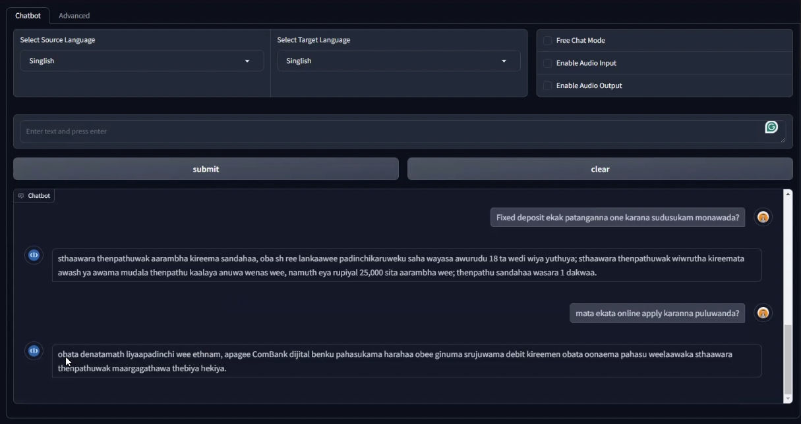

# Rag Services

 - An end-to-end RAG pipeline with both text and audio input-output support with fully customizable system architecture.
 - We have initially developed this to handle *Siglish* (i.e. Romanized Sinhala typing. Not Singaporean English) specially to handle casual day-today customer interactions.
 - This can be extended easily to any language pair as far as you have good enough models to perform the back and forth translation between English and the other language. 

## System Overview


## System Architecture


## Demo Interface


[**Watch our Demo Video**](https://drive.google.com/file/d/1yqi3q2ZIxqeI7gozgqBCAk5PSUeSyaBv/view?usp=sharing)

## Components
### Compute Service:
This is the heavy computation services of the system.
- **LLM Service** - LLM is up and running here
- **Embedding Service** - Sentence/Document embedding service is running here
- **Translator Service** - All direction translation service is running here
- **STT Service** - Speech-To-Text service is running here
- **TTS Service** - Text-To-Speech service is running here

### Bot Backend:
This is the full RAG pipeline which answers a user query using the available knowledge bases fed to the system.

- **Bot Service** - The RAG pipeline
- **DB Service** - The RAG knowledge base store
### Client App:
Client frontend App that the user interacts with the bot/system.

## Getting Started

### Setup the Environment

  * You can create the conda environment named `rag_env` with the given `environment.yml` file.
  ```shell
    conda env create -f environment.yml
  ```

### Start the System

The 3 services should be run as 3 separate services (in separate terminals).
- Compute Service is independent of others
- Bot Backend is depending upon the Compute Service
- Bot Frontend is depending upon the Bot Backend

You can access the services as follows

1. Start the compute service

Check .env file and the yml files of each service. You may need to fill certain fields in yml files. In .env file, keep fields empty if a variable should be set as `False`.
```
conda activate rag_env
cd compute_service
python main.py
```

2. Start the bot backend

Check the .env file. Keep fields empty if a variable should be set as `False`. 
```
conda activate rag_env
cd bot_backend
python main.py
```

3. Start the frontend app
```
conda activate rag_env
cd bot_frontend
python app_v2.py
```


## Dockerization (Not up to date)

**Note: The docker file is not up to date**

The services can be containerized using the following steps.
### Build the Image:
```docker build -t rag_services .```

### Run the Container
```docker run --gpus all -p 8001:8001 -p 8002:8002 -p 7860:7860 rag_services```

You can access the services as follws
#### Linux:
- compute service: http://127.0.0.1:8001
- bot backend: http://127.0.0.1:8002
- client app: http://127.0.0.1:7860

#### Windows (127.0.0.1 may not work in Windows):
- compute service: http://host.docker.internal:8001
- bot backend: http://host.docker.internal:8002
- client app: http://host.docker.internal:7860

## Roadmap

- [ ] Complete Bot Backend
    - [x] Basic RAG Flow
    - [x] Session Management
    - [x] RAG mode and LLM-only chat mode
    - [x] Handle both text and voice input and output
    - [x] Add knowledge to vector db through API
    - [x] Trace Responses
    - [ ] Further Improvements
- [ ] Complete Compute Service
    - [ ] LLM Service
        - [x] Huggingface
        - [x] Ollama
        - [x] Llama-cpp
        - [ ] Openai
    - [ ] Embedding Service
        - [x] Huggingface
        - [x] Sentence Transformers
        - [ ] Openai
    - [ ] Translation Service
        - [x] Huggingface
        - [ ] Google Translate API
    - [ ] ASR Service
        - [x] Huggingface
        - [x] Openai-whisper
    - [ ] TTS Service
        - [x] Huggingface
        - [x] CoquiTTS
- [ ] Complete Frontend APP
    - [x] Basic chat interface
    - [x] Add knowledge to RAG (i.e. File Upload, URL fetch)
    - [ ] Get rid of Gradio
- [ ] Update Docker Image
- [ ] Generalize Multilingual Support
- [ ] Voice Streaming Capability

## Contributors

- [Kasun Wickramasinghe](https://www.linkedin.com/in/kasun-wickramasinghe-7b746a152/)
- [Sachin Siriwardhana](https://www.linkedin.com/in/sachinsiriwardhana/)
- [Nipuna Solangaarachchi](https://www.linkedin.com/in/nipuna-solangaarachchi-00136b15b/)

## Contact Us

[xphoenixai@gmail.com](mailto:xphoenixai@gmail.com)
