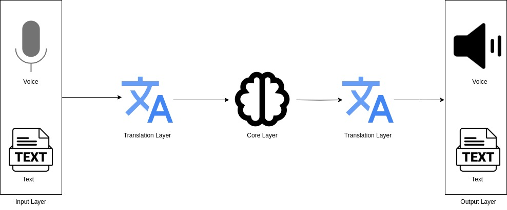

# Rag Services

## System Overview


## System Architecture


## Components
### Compute Service:
This is the heavy computation services of the system.
- **LLM Service** - LLM is up and running here
- **Embedding Service** - Sentence/Document embedding service is running here
- **Translator Service** - All direction translation service is running here
- **STT Service** - Speech-To-Text service running here
- **TTS Service** - Text-To-Speech service running here

### Bot Backend:
This is the full RAG pipeline which answers a user query using the available knowledge bases fed to the system.

- **Bot Service** - The RAG pipeline
- **DB Service** - The RAG knowledge base store
### Client App:
Client frontend App that the user interacts with the bot/system.

## Dockerization

The services can be containerized using the following steps.
### Build the Image:
```docker build -t rag_services .```

### Run the Container
```docker run --gpus all -p 8001:8001 -p 8002:8002 -p 7860:7860 rag_services```

You can access the services as follws
#### Linux:
- compute service: http://127.0.0.1:8001
- bot backend: http://127.0.0.1:8002
- client app: http://127.0.0.1:7860

#### Windows (127.0.0.1 may not work in Windows):
- compute service: http://host.docker.internal:8001
- bot backend: http://host.docker.internal:8002
- client app: http://host.docker.internal:7860
